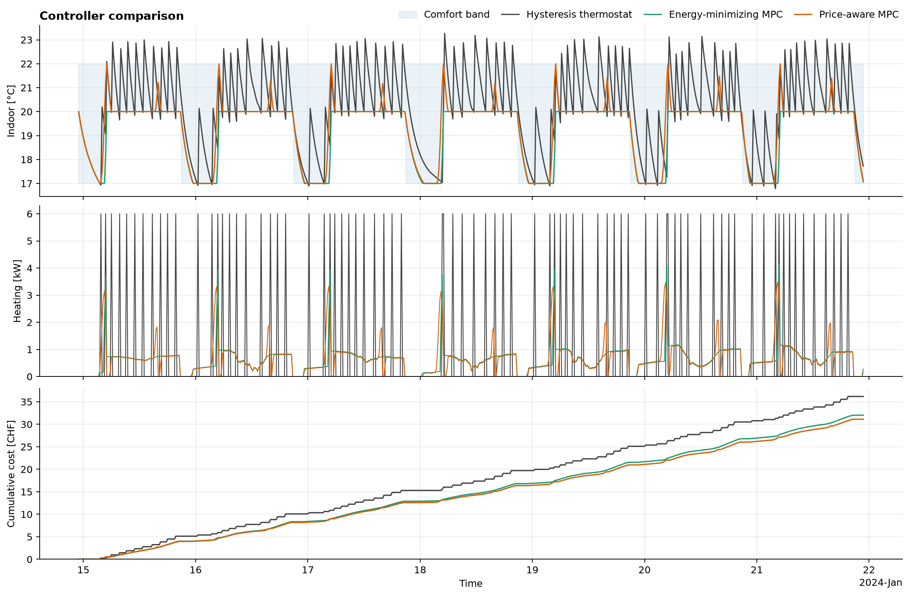
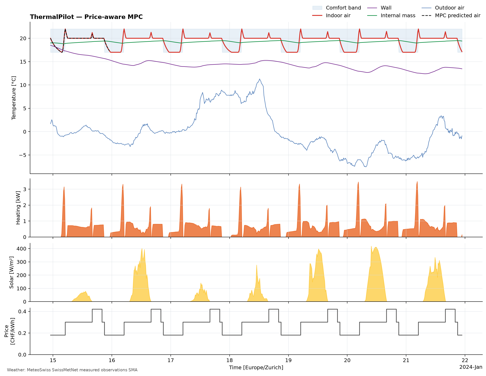

# ThermalPilot

ThermalPilot is a small, reproducible heating-control simulation for a
synthetic 70 m² apartment in Zurich. It compares a basic on/off thermostat
with energy-minimizing and price-aware model-predictive control (MPC).

The building is not a calibrated real apartment. Its geometry, thermal
parameters, comfort schedule, tariff, and initial conditions are assumptions.
Outdoor temperature and solar radiation come from MeteoSwiss when available;
an explicitly labelled synthetic weather generator keeps the project usable
offline.

## Example result

The default run covers 15–22 January 2024 at 15-minute resolution. The snapshot
below used measured observations from the MeteoSwiss SMA station in Zurich and
the default synthetic time-of-use tariff.

| Controller | Energy [kWh] | Cost [CHF] | Comfort violation [K·h] | Peak [kW] |
|---|---:|---:|---:|---:|
| Hysteresis thermostat | 120.00 | 36.18 | 18.789 | 6.00 |
| Energy-minimizing MPC | 106.71 | 32.02 | 0.035 | 4.14 |
| Price-aware MPC | 108.61 | 31.12 | 0.010 | 3.49 |



The outcome is consistent with the controller objectives. Energy MPC uses the
least heat. Price-aware MPC uses about 1.9 kWh more, but shifts demand away from
the expensive period and reduces cost by 2.8% relative to energy MPC. Both MPC
controllers stay effectively inside the comfort band. The thermostat is an
intentionally simple benchmark: full-power, 15-minute switching produces the
visible overshoot and cycling.

The detailed view shows the price-aware controller alongside the weather,
comfort schedule, tariff, and one 24-hour prediction made at the start of the
run.



These numbers describe this model and this week only. They are a useful
controller comparison, not a claim about savings in an actual apartment.

## Quick start

The project uses Python 3.10 or newer and [uv](https://docs.astral.sh/uv/).

```bash
uv sync --all-extras

uv run thermalpilot model-info
uv run thermalpilot simulate --controller all --weather auto --interactive
```

Generated CSV files, metrics, provenance, figures, and optional HTML are
written to `outputs/`. To force reproducible offline weather, replace `auto`
with `synthetic`.

The Streamlit parameter dashboard is available with:

```bash
uv run streamlit run src/thermalpilot/dashboard.py
```

An optional schematic apartment animation can also be exported:

```bash
uv run thermalpilot simulate --controller price-mpc --weather auto --animate gif
```

## Model in brief

The apartment is represented by indoor-air, exterior-wall, and internal-mass
temperatures. Heater power is the control input; outdoor temperature and solar
radiation are disturbances. The continuous RC network is converted to the
15-minute model with an exact zero-order hold:

$$x_{k+1}=Ax_k+Bu_k+Ed_k.$$

The default controller uses a 24-hour receding horizon, a 6 kW heating limit,
and a comfort band of 20–22 °C from 06:00 to 22:00 with a 17 °C overnight lower
bound. Comfort slack keeps the optimization feasible during initialization or
extreme conditions. The price-aware controller may preheat within the comfort
band when later energy is more expensive. The default comparison supplies the
future realized weather as a perfect forecast; `--forecast-noise` adds
repeatable forecast error for less idealized runs.

The main assumptions are collected in
[`config.py`](src/thermalpilot/config.py), and `thermalpilot model-info` prints
the matrices and physical plausibility checks used by the running code.

## Weather and provenance

`--weather meteoswiss` loads 10-minute temperature and global-radiation data
for the SMA station from the official SwissMetNet archive, converts timestamps
to `Europe/Zurich`, and averages them onto the control grid. `--weather auto`
falls back to seeded synthetic weather if measured data cannot be loaded.

Every run writes `provenance.json`, which records the weather source, model
parameters, simulation settings, and plausibility checks. The time-of-use
prices are illustrative synthetic values, not a Zurich utility tariff.

## Validation

```bash
uv run pytest
uv run ruff check .
```

The tests cover the model matrices, exact discretization, stability, weather
generation, controller constraints and dynamics, closed-loop output, and
figure layout. The model deliberately leaves out humidity, cooling, internal
gains, multiple zones, state estimation, and parameter identification.
